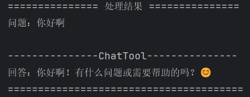

# Agent_Workflow 项目

<div align="center">


</div>

## 📑 目录

- [项目状态](#-项目状态)
- [项目简介](#-项目简介)
- [核心功能](#-核心功能)
- [快速开始](#-快速开始)
- [许可证](#-许可证)
- [鸣谢](#-鸣谢)

## 🚧 项目状态

> **Note:** 项目正处于积极开发阶段，更多功能正在持续完善中。

## 📖 项目简介

Agent_Workflow 是一个基于 langchain/Ollama 的智能体框架，旨在帮助开发者快速构建单/多智能体系统。项目提供了丰富的工具集成和便捷的部署方式。

## 🚀 核心功能

### 📌 工具支持

<details>
<summary><b>天气查询</b> - 基于高德API</summary>

- 需配置 `GAODE_WEATHER_API_KEY`
- [查看示例输出](https://github.com/panxingfeng/agent_chat_wechat/blob/master/images/weathertool_result.png)
</details>

<details>
<summary><b>智能搜索</b> - 基于Perplexica</summary>

- 使用Docker部署
- [配置说明](https://github.com/ItzCrazyKns/Perplexica)
- [查看示例输出](https://github.com/panxingfeng/agent_chat_wechat/blob/master/images/searchtool_result1.png)
</details>

<details>
<summary><b>PDF转换工具</b></summary>

- 支持URL转PDF等功能
- [控制台输出](https://github.com/panxingfeng/agent_chat_wechat/blob/master/images/pdftool_console_output.png)
- [转换结果示例](https://github.com/panxingfeng/agent_chat_wechat/blob/master/images/pdf_converter_result.png)
</details>

<details>
<summary><b>图像识别</b></summary>

- 支持 llama3.2vision/MiniCPM(后续上传)
- 基于 ollama 部署
- [查看示例输出](https://github.com/panxingfeng/agent_chat_wechat/blob/master/images/imagetool_result.png)
</details>

<details>
<summary><b>语音工具</b></summary>

- 支持 F5-TTS、GPT-SoVITS(近期上传)
- 感谢:[F5-TTS](https://github.com/SWivid/F5-TTS) [GPT-SoVITS](https://github.com/RVC-Boss/GPT-SoVITS)
- [控制台输出示例](./images/audio_tool_result.png)
- <audio controls>
     <source src="https://github.com/panxingfeng/agent_workflow/blob/main/output/2024-11-26/output-1732619878036.wav" type="audio/mpeg">
     你的浏览器不支持播放这个音频文件，可以打开output/2024-11-26/output-1732619878036.wav
   </audio>
</details>

### 🔌 启动方式

- ✅ vchat微信接入（支持聊天，搜索工具，天气查询）
  ```
  tools = [
     WeatherTool(),
     FileConverterTool(),
     ChatTool(),
     ImageTool(),
     SearchTool()
  ]  #传入工具集 
  
  asyncio_run(
      demo=Task(
          tool_manager=ToolManager(
              tools=tools
          )
      ).vchat_demo()
  )  # 接入微信
  ```
- 🚧 FastAPI服务（开发中）
- 🚧 飞书机器人接入（计划中）

## 🚀 快速开始

### 环境准备

```bash
# 1. 克隆项目
git clone https://github.com/panxingfeng/agent_workflow.git
cd agent_workflow

# 2. 创建虚拟环境
conda create --name agent_workflow python=3.10
conda activate agent_workflow

# 3. 安装依赖
pip install -r requirements.txt -i https://pypi.tuna.tsinghua.edu.cn/simple/
```

### 配置说明

1. Perplexica 搜索工具
   - 推荐使用Docker安装
   - [详细安装说明](https://github.com/ItzCrazyKns/Perplexica)

2. 天气工具
   - 需申请高德API密钥
   - 配置于 `config.py`中的`GAODE_WEATHER_API_KEY`参数

3. 语音工具
   - 需要使用没有噪音的语音文件，效果最佳

### 运行示例

```bash
python main.py
```



## 📄 许可证

本项目基于 MIT 协议开源，使用时请保留作者信息。

## 🙏 鸣谢

- [langchain](https://github.com/langchain-ai/langchain) - 提供项目框架基础
- [VChat](https://github.com/z2z63/VChat) - 提供微信客户端接入支持
- [ollama](https://github.com/ollama/ollama) - 提供本地模型部署支持
- [Perplexica](https://github.com/ItzCrazyKns/Perplexica) - 提供搜索工具支持

---

<div align="center">

如果觉得项目有帮助，欢迎 Star ⭐️

</div>
