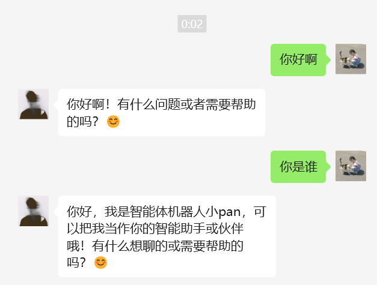

# Agent_Workfolw 项目

## 目录

- [项目简介](#项目简介)
- [功能](#功能)
- [使用说明](#使用说明)
- [许可证](#许可证)

## 项目简介

本项目<Agent_Workfolw>是基于langchain/Ollama实现快速创建 单agent智能体/多agent智能体

## 功能
- (已完成)工具支持(描述信息可以使用 工具.get_description查看功能)
    - 天气（高德API）：需要在config中填入GAODE_WEATHER_API_KEY的值即可 [控制台输出结果](https://github.com/panxingfeng/agent_chat_wechat/blob/master/images/weathertool_result.png)
    - 联网搜索（Perplexica）：使用docker部署的Perplexica工具，安装方法：[Perplexica](https://github.com/ItzCrazyKns/Perplexica) [控制台输出结果](https://github.com/panxingfeng/agent_chat_wechat/blob/master/images/searchtool_result1.png)
    - pdf文件转换工具:支持url_to_pdf... [控制台输出结果](https://github.com/panxingfeng/agent_chat_wechat/blob/master/images/pdftool_console_output.png) [pdf转换结果](https://github.com/panxingfeng/agent_chat_wechat/blob/master/images/pdf_converter_result.png)
    - 图像识别（llama3.2vision/MiniCPM）：基于ollama中的llama3.2 vision实现图像识别，也支持接入MiniCPM v2.6 [控制台输出结果](https://github.com/panxingfeng/agent_chat_wechat/blob/master/images/imagetool_result.png)
    - 提示词模板工具(支持搜索模板和模板设置):[模板参考地址](https://github.com/panxingfeng/awesome-chatgpt-prompts) [控制台输出结果1](https://github.com/panxingfeng/agent_chat_wechat/blob/master/images/prompt_result1.png)[控制台输出结果2](https://github.com/panxingfeng/agent_chat_wechat/blob/master/images/prompt_result2.png)(需完善)
    - URL工具：支持动态参数设置，设置提取的输出值(put="content")即可输出返回值中content的值(需完善)
    - 代码工具：使用ollama部署的qwen2.5-coder:32b，也可修改其他的版本
- (近期完成)启动方式
    - 基于fastapi，启动服务后，使用api进行接入其他的服务
    - (已完成)通过vchat接入微信(暂时只支持文本内容)
    - 
    - 接入飞书机器人
    - ...
## 使用说明
- Perplexica开源项目是支持本项目的搜索工具实现，推荐docker安装 [安装地址](https://github.com/ItzCrazyKns/Perplexica)
- 天气工具使用的是高德API，需要进行申请并填入config.py中

目前软件还在编写中，后续可以使用 pip install agent_workflow

## 许可证

基于MIT协议开源本项目，禁止修改项目中本作者信息。
