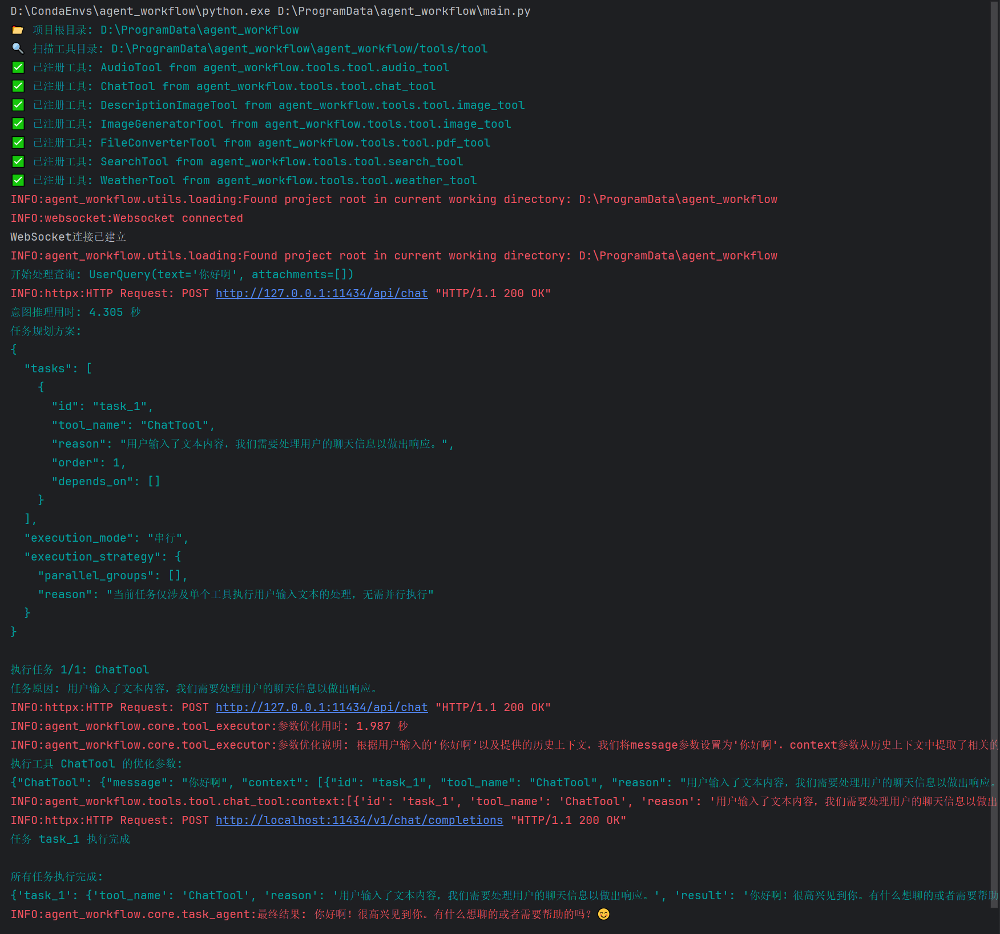

# Agent_Workflow 项目

<div align="center">


</div>

<div align="center">

如果觉得项目有帮助，欢迎 Star ⭐️

</div>

## 📑 目录

- [项目简介](#-项目简介)
- [核心功能](#-核心功能)
- [快速开始](#-快速开始)
- [更新计划](#-更新计划)
- [错误预览](#-错误预览)
- [许可证](#-许可证)
- [鸣谢](#-鸣谢)

## 📖 项目简介

Agent_Workflow 是一个基于 langchain/Ollama 的智能体框架，旨在帮助开发者快速构建单/多智能体系统。项目提供了丰富的工具集成和便捷的部署方式。

## 🚀 核心功能

### 📌 工具支持

<details>
<summary><b>天气查询</b> - 基于高德API</summary>

- 需配置 `GAODE_WEATHER_API_KEY`
- [查看示例输出](https://github.com/panxingfeng/agent_chat_wechat/blob/master/images/weathertool_result.png)
</details>

<details>
<summary><b>智能搜索</b> - 基于Perplexica</summary>

- 使用Docker部署
- [工具项目地址](https://github.com/ItzCrazyKns/Perplexica)
- [查看示例输出](https://github.com/panxingfeng/agent_chat_wechat/blob/master/images/searchtool_result1.png)
- 【重要】ollama 安装embedding模型 ollama run bge-m3】
</details>

<details>
<summary><b>PDF转换工具</b></summary>

- 支持URL转PDF等功能
- [控制台输出](https://github.com/panxingfeng/agent_chat_wechat/blob/master/images/pdftool_console_output.png)
- [转换结果示例](https://github.com/panxingfeng/agent_chat_wechat/blob/master/images/pdf_converter_result.png)
</details>

<details>
<summary><b>图像工具</b></summary>

- 图像识别 支持 llama3.2vision/MiniCPM/glm-edge-v
- 图像生成 支持 flux.1-dev(本地部署)、sd-3.5-large(本地部署)、sd-webui
- sdwebui 支持 forge(使用flux模型)(基于selenium实现，原生api不支持flux生成,需安装谷歌浏览器)
- [图像识别示例输出](https://github.com/panxingfeng/agent_chat_wechat/blob/master/images/imagetool_result.png)
</details>

<details>
<summary><b>语音工具</b></summary>

- 支持 F5-TTS(需要使用一次gradio客户端进行语音文件的生成)、GPT-SoVITS
- 感谢:[F5-TTS](https://github.com/SWivid/F5-TTS) [GPT-SoVITS](https://github.com/RVC-Boss/GPT-SoVITS)

</details>

### 🔌 启动方式

- ✅ vchat微信接入 [实现实例1](./images/wechat_demo1.png)、[实现实例2](./images/wechat_demo2.png)、[实现实例3](./images/wechat_demo3.png)
  ```
    agents = [
        ChatAgent()
    ]
    # 创建智能体调度
    master = MasterAgent(agents)
    # 微信启动
    await master.vchat_demo()
  ```
- ✅ FastAPI服务 [实现实例1](./images/fastapi_demo1.png)、[实现实例2](./images/fastapi_demo2.png)
  ```
    agents = [
        ChatAgent()
    ]
    # 创建智能体调度
    master = MasterAgent(agents)
    # 微信启动
    await await master.fastapi_demo()
  ```
- ✅ 飞书机器人 [实现实例1](./images/feishu_demo1.png)、[实现实例2](./images/feishu_demo2.png)
  ```
    agents = [
        ChatAgent()
    ]
    # 创建智能体调度
    master = MasterAgent(agents)
    # 微信启动
    await master.feishu_demo()
  ```
## 🚀 快速开始

### 环境准备

```bash
# 1. 克隆项目
git clone https://github.com/panxingfeng/agent_workflow.git
cd agent_workflow

# 2. 创建虚拟环境
conda create --name agent_workflow python=3.10
conda activate agent_workflow

# 3. 安装依赖
pip install -r requirements.txt -i https://pypi.tuna.tsinghua.edu.cn/simple/


# 3.1 使用文件转换工具需要安装
pip install playwright
playwright install  # 安装Playwright 的浏览器

```

### 配置说明

1. Perplexica 搜索工具
   - 推荐使用Docker安装
   - [详细安装说明](https://github.com/ItzCrazyKns/Perplexica)

2. 天气工具
   - 需申请高德API密钥
   - 配置于 `config.py`中的`GAODE_WEATHER_API_KEY`参数

3. 语音工具
   - 语音克隆,需要使用没有噪音的语音文件，效果最佳

4. 图像工具
   - 根据自己电脑的内存进行选择
   - 如果出现forge启动器挂壁过多次，可以切换sdwebui(速度更快) ps:sdwebui的代码需要进行调整
   - 目前默认生图工具forge_sdwebui,识别工具llama3.2-vision
   - config下的base_model_info.xlsx和lora_model_info.xlsx是填入使用到的模型的一些预设信息
   - 提示词生成有两个模式可选，rag和llm，<rag>是我把sd主流的tag提示词放到了本地rag中，<llm>是直接使用llm进行生成，默认为None，即分发任务时程序自动设置

5. 自定义创建工具/智能体示例代码
   - 参考example下的参考代码
    
6. 网盘链接(模型、环境包<如果环境有问题可以选择直接下载以后复制到conda创建的目录下>) -> [链接](https://pan.baidu.com/s/1NL8GLMGwu7jjuI0k-iAvtg?pwd=sczs)

### 运行示例
```bash
python main.py # 后续缺失什么就安装什么
```



## 📅 更新计划

### 🎨 图像工具
- [ ] 支持 ComfyUI 和 Stable Diffusion WebUI
   - ComfyUI 工作流集成  
   - SDWebUI API 接入
   - ComfyUI更多的功能工作流

### 🎥 视频工具
- [ ] 基于ComfyUI的视频生成功能
   - Text to Video (T2V)
   - Image to Video (I2V)
   - Video to Video (V2V)

### 🎵 音频工具
- [ ] 基于ComfyUI的音频生成功能
   - 文本到音频转换
   - 基于操作界面的语音训练功能

### 💻 UI界面
- [ ] 基于react的Web界面
   - 多模态输入支持
   - 工作流可视化支持
   - ...

ps:工作流正在陆陆续续的搭建和测试中

## ⚠️ 错误修改

- 陆续更新中

1. 出现了这种错误是因为没有填写config文件中的sd的api账户信息未设置
```bash
获取模型列表时发生错误: 401 Client Error: Unauthorized for url: http://127.0.0.1:7862/sdapi/v1/sd-models
```

## 📄 许可证

本项目基于 MIT 协议开源，使用时请保留作者信息。保护好开源环境

可能涉及侵权风险，本项目生成的内容禁止商用，仅可用作学习和研究使用，请合法合规使用，后续因生成内容产生纠纷，与本人无关。

## 🙏 鸣谢

- [langchain](https://github.com/langchain-ai/langchain) - 提供项目框架基础
- [VChat](https://github.com/z2z63/VChat) - 提供微信客户端接入支持
- [ollama](https://github.com/ollama/ollama) - 提供本地模型部署支持
- [Perplexica](https://github.com/ItzCrazyKns/Perplexica) - 提供搜索工具支持
- [F5-TTS](https://github.com/SWivid/F5-TTS)、[GPT-SoVITS](https://github.com/RVC-Boss/GPT-SoVITS) - 提供语音工具的支持
---
